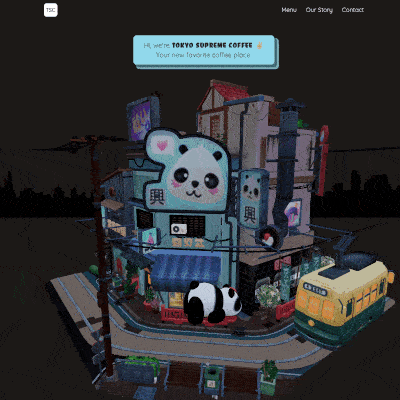

<p align="center">
  <a href="https://reactjs.org/" target="_blank">
    
  </a>
  <a href="https://threejs.org/" target="_blank">
    
  </a>
  <a href="https://tailwindcss.com/" target="_blank">
    
  </a>
</p>

## Deployment

<a href="https://tsc-three-js.vercel.app/" target="_blank">
  <p>https://tsc-three-js.vercel.app</p>
</a>
<div align="center">
   
</div>

## About This Project

I wanted to create a **3D website** that immediately catches attention at first glance.  
To achieve this, I imagined a **Tokyo coffee shop** and designed how it could be presented online in an interactive and playful way.

The project features **slight animations and 3D interactivity** to engage users and keep them interested while exploring the coffee shop experience.  
It blends aesthetic design with technical creativity, giving the visitor a sense of stepping into a warm, modern Tokyo café.

## Tech Stack

<ul>
  <li>React</li>
  <li>Three.js</li>
  <li>Tailwind CSS</li>
</ul>

## Setup

### Prerequisites

<ul>
<li><a href="https://git-scm.com/" rel="nofollow">Git</a></li>
<li><a href="https://nodejs.org/en" rel="nofollow">Node.js</a></li>
<li><a href="https://www.npmjs.com/" rel="nofollow">npm</a></li>
</ul>

### Installation

```sh
npm install
npm run dev
```
